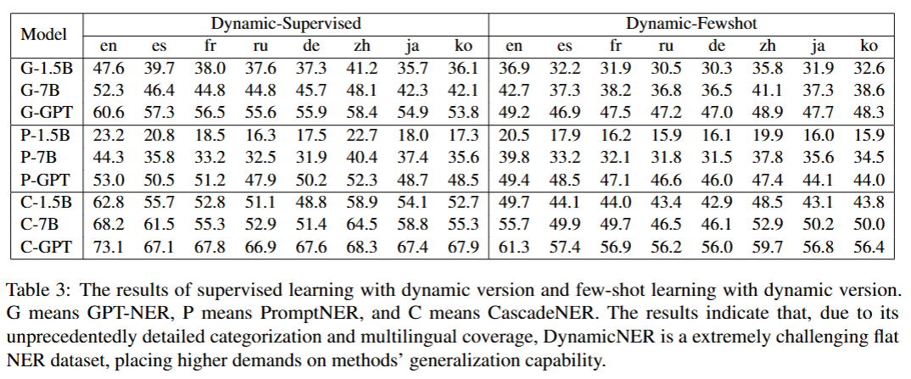

# DynamicNER: A Dynamic, Multilingual, and Fine-Grained Dataset for LLM-based Named Entity Recognition
This repository is supplement material for the paper: DynamicNER: A Dynamic, Multilingual, and Fine-Grained Dataset for LLM-based Named Entity Recognition

## 💓Update!
* DynamicNER is disclosed now! Please download it from Huggingface for train and evaluation!

* We add more GEIC format existing datasets and also the format for fine-tuning and inferrence based on SWIFT! You can test CascadeNER easier!

* We provide a demo.py now. You can test your own sentence in a very simple way!

* We discover a problem that as SWIFT has been updated and some parameters has been changed, so please use the old version (according to requirements.txt)

## 📚 Features
* This repository includes CascadeNER and DynamicNER, our NER framework and our dataset

* DynamicNER is the first dataset specially designed for NER with LLMs with a novel dynamic categorization system. It's multilingual and fine-grained.

* CascadeNER is the first universal and multilingual NER framework with SLMs, which supports both few-shot and zero-shot scenarios and achieves SOTA performance on low-resource and fine-grained datasets

## 📈 Quantitive Result:

  

## 📌 Prerequisites

1. `conda create -n cascadener python=3.10`
2. `pip install -r requirements.txt`
3. You may also use a standard environment for [SWIFT](https://github.com/modelscope/ms-swift).
4. Download the fine-tuned [extractor](https://huggingface.co/CascadeNER/models_for_CascadeNER/tree/main) and [classifier](https://huggingface.co/CascadeNER/models_for_CascadeNER/tree/main), and place them into the corresponding paths. Both models are fine-tuned based on QWEN2.5.
5. You may also download [DynamicNER](https://huggingface.co/datasets/CascadeNER/DynamicNER/tree/main) and [other GEIC format dataset](https://huggingface.co/datasets/CascadeNER/DynamicNER/tree/main) to train your own model.

## 🌟 Usage
* Train: please use [SWIFT](https://github.com/modelscope/ms-swift) for model training. We strongly recommend Qwen2.5 for your base models. You may use follow the examples in any `train.json` from GEIC format dataset in huggingface to get the format of train sets. We now provide a example in `./DynamicNER/example.json`

* First, prepare your own dataset for infer and use `./DynamicNER/transformation/stage1_trans.py` to get input file for inferrence. You may also use the datasets we provided in GEIC format.

* Second, change your own paths in `infer.py` and `extract.sh`, including two model paths, dataset path, category path, and output path.

* Last, run `infer.py` and your will receive the results.

* Eval: If you want to evaluate our framework, please use `evaluate.py`. You can use the dataset in GEIC format other the results to evaluate.

* PS: Due to the update of SWIFT, you may need to use the old version to directly use our code, or you can modify the code slightly with the guidance from [SWIFT](https://github.com/modelscope/ms-swift). We will later provide a updated version of code for this problem.

## ❤️ Acknowledgement
* We thank QwenLM for opening source their [Qwen](https://github.com/QwenLM/Qwen) model for us
* We thank ModelScope for opening source their [SWIFT](https://github.com/modelscope/ms-swift) framework for us
* We thank teams of CoNLL2003, CrossNER, FewNERD, MultiCoNER and PAN-X for opening source their datasets
