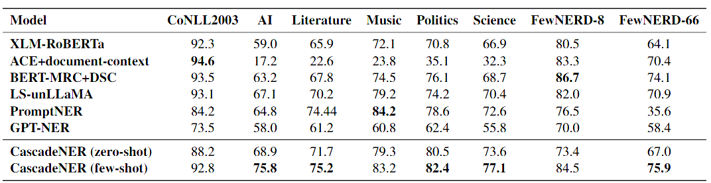
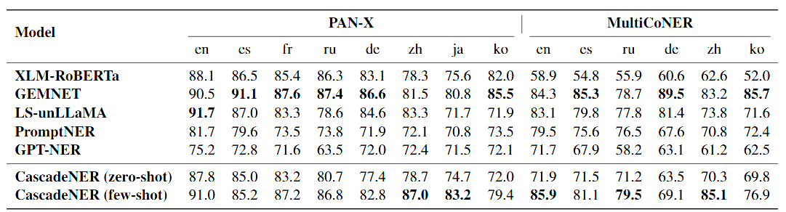

# GEIC: Universal and Multilingual Named Entity Recognition with Large Language Models
This repository is supplement material for the paper: GEIC: Universal and Multilingual Named Entity Recognition with Large Language Models  
📖:  &nbsp; &nbsp; &nbsp; &nbsp; &nbsp; &nbsp; &nbsp; &nbsp;

## 📚 Features
* This repository includes CascadeNER and AnythingNER, our NER framework and our dataset

* CascadeNER is the first universal and multilingual NER framework with SLMs, which supports both few-shot and zero-shot scenarios and achieves SOTA performance on low-resource and fine-grained datasets

* AnythingNER is the first multilingual and fine-grained datasets designed for NER with LLMs, especially GEIC, with a novel dynamic categorization system

## 📈 Quantitive Result:

  

  

## 📌 Prerequisites

1. `conda create -n cascadener python=3.10`
2. `pip install -r requirements.txt`
3. You may also use a standard environment for [SWIFT](https://github.com/modelscope/ms-swift).
4. Download the fine-tuned [extractor] and [classifier](https://huggingface.co/CascadeNER/models_for_CascadeNER/tree/main), and place them into the corresponding paths. Both models are fine-tuned based on QWEN2-1.5B.

## 🌟 Usage
* Train: please use [SWIFT](https://github.com/modelscope/ms-swift) for model training. We strongly recommend Qwen2 and Gemma for your base models. You may use follow the examples in `train` to get the format of train sets.

* First, prepare your own dataset in GEIC format for infer and use `geic2input.py` to get input file for inferrence. You may also use the datasets we provided in GEIC format.

* Second, change your own paths in `infer.py` and `extract.sh`, including two model paths, dataset path, category path, and output path.

* Last, run `infer.py` and your will receive the results.

* Eval: If you want to evaluate our framework, please use `evaluate.py`. You can use the dataset in GEIC format other the results to evaluate.

## 😭Some Bad News
Due to certain legal and regulatory restrictions in certain countries, we are unable to disclose AnythingNER until we have completed our ethical and legal review. When we checked the Chinese version of AnythingNER, we found that some of the data violated Chinese laws. Due to questions raised by our funders about this issue and whether the same issue would exist in other languages, we have had to delay the launch of AnythingNER and conduct a full review and possible partial changes to avoid possible legal issues. We expect to disclose AnythingNER by 10.5. Sorry for this!

## ❤️ Acknowledgement
* We thank QwenLM for opening source their [Qwen](https://github.com/QwenLM/Qwen) model for us
* We thank ModelScope for opening source their [SWIFT](https://github.com/modelscope/ms-swift) framework for us
* We thank teams of CoNLL2003, CrossNER, FewNERD, MultiCoNER and PAN-X for opening source their datasets
